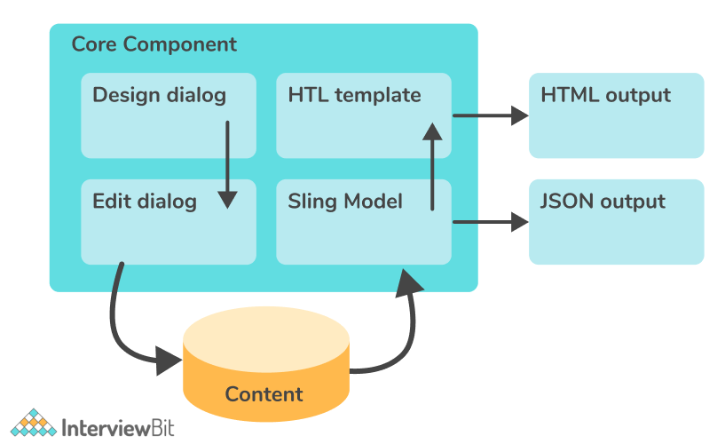

# AEM Components

## What Defines a Component in AEM

In AEM, components define reusable modules that execute specific application lofic to generate the content. Every material available in the web pages is held, formatted and rendered using Components. These components can also provide the ability to "author" them as it is often called in the AEM context, defining specific values depending on multiple factors.

## Pieces of a Component

Commonly, a component will have a JSP and or a HTML file.

### Composition of a Component

## Overlay/Override Concept

The overlay/override component is used when you want an out of the box component in AEM but you need to add extra features to it, by changing it across all instances of that component. For example, if you need to add specific properties to the OOTB "text" component, but you do not want to create a new component, you'd need to copy the component from "libs/foundation/components" into "apps/foundation/components" and keep the same folder structure as the original. 

With this done, any changes done to the new component will be reflected in the OOTB "text" component, without causing changes to the original code under "libs".

## Extending Components

To extend a component essentially means that you want to create a new component without overriding the base component, but will have the same features as the original, providing you the possibility of changing/building upon the original component. 

In order to extend a component, you should set "sling:resourceSuperType" of the component to the base component you'd like to extend. When you do this, you inherit everything from the base component.

## Dialog vs Design Dialog

A dialog represents a key element of the component, since it is what provides an interface for authors to configure and provide input to the component. This input should be stored at page level in the jcr. A design dialog is a dialog that will only display when in design mode. The input received here should be stored at template level and is accessed across all site.

Dialog -> stored in page level on JCR
Design Dialog -> stored in template level

## How to Add Properties to the Page Properties Dialog

To be able to add properties to your page properties dialog, you should copy the dialog located under "libs/foundation/components/page/dialog" and add it to your page template. With this you are allowed to add new tabs and add new properties for the author to chose from for pages that use that template.

## Difference Between parsys and iparsys

parsys -> Also called "Paragraph System", it is a component in which you can add other components at the page level

iparsys -> The inherited paragraph system, which inherits the parent page "paragraph system"

## Difference Between "par base" and "parsys"

par base -> Allows components to inherit attributes from other components, similar to subclasses OOP. For example, when opening the /libs/foundation/components/text node in CRX Explorer, you'd see that it has a property named "sling:resourceSuperType" which references the par base component. The par base here defines tree scripts to render images, titles and others so all components subclassed from this par base can use the same script.

phrases (Paragraph System [parsys]}) -> Compound component that allows authors to add components of different types to a page and contains all other paragraph components. Each paragraph type is represented as a component. The parsys system itself is a component alos, which contain other parsys components.

## Adaptive Form

Used to break down forms into logical sections, basically enables end users to focus on filling the form. If we need input from the user we use Adaptive Form.

## Adaptive Document

Used to display output to the end user. As in a bank statement is and adaptive document because all of its content remains the same only name and amount changes. Basically it holds placeholder text that dinamically changes on run time.

## EditConfig Node Usage at Component Creation

Node used mainly for helping defining the component behavior.