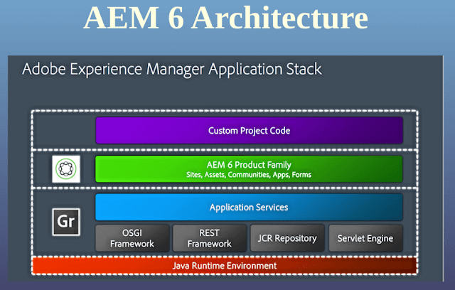

# AEM Tech Stack

The foundation of the AEM Tech Stack is composed mainly by Apache Sling, OSGi(Apache Felix) and JCR.

## Apache Sling

RESTful framework for interacting with the JCR via HTTP protocol. The request URL will then be mapped to the JCR node specifically.

## OSGi

Java framework that allows the construction of modular applications. In runtime, each module, reffered as bundle can be stopped and started individually.

### OSGi (Open Service Gateway Initiative) Advantages

- Applications more adaptive to changing requirements because of being portable and easier to re-engineer
- The framework delivers a Spring-like declarative assembly and simplified unit testing in a standardized version that is provided as part of the application server runtime instead of a third-party library installed as part of the application.
- Compatible with Java EE programming model, allowing to deploy a web app as a collection of versioned OSGi bundles with a dynamic lifespan
- Simplifies and standardizes third-party library integration in allowing administrators to manage application bundle dependencies and versions
- In a module level, the framework encourages a service-oriented design

### OSGi Component Lifecycle
- INSTALLED- The bundle has been installed in the OSGi container, but some of its dependencies have still to be satisfied. The bundle requires packages that haven't been exported by any of the other bundles that are presently installed.
- RESOLVED- The bundle has been installed, and the OSGi system has connected and resolved all of the dependencies at the class level. The bundle is now ready to use. When a bundle is started, it skips this state if all of the bundle's dependencies are met.
- STARTING -It is the temporary state in which the bundle exists while it is being loaded after all dependencies have been resolved. The BundleActivator.start method will be invoked, but it hasn't returned yet.
- ACTIVE - The bundle is active, however, it is disabled while Spring is working. Spring examines the Spring setup and creates the context before passing it on to the plugin. In order to make instances of each plugin module, the plugin requires context.
- STOPPING - It is a brief state in which the bundle is in when it is stopping. Although the BundleActivator.stop function has been called, it has yet to return.
- UNINSTALLED - The bundle has been removed from the OSGi container.

## JCR

## AEM 6 (CQ6)

