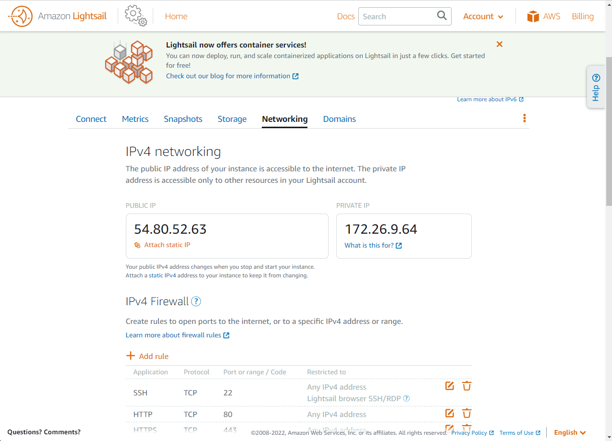
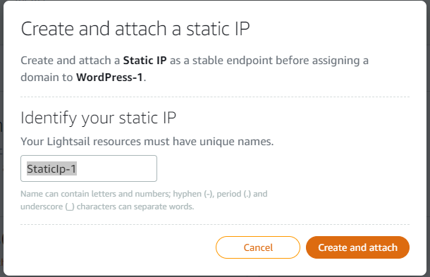
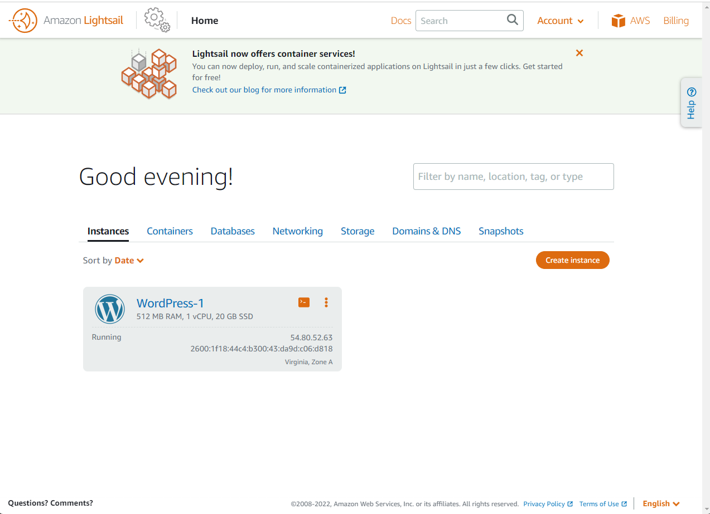
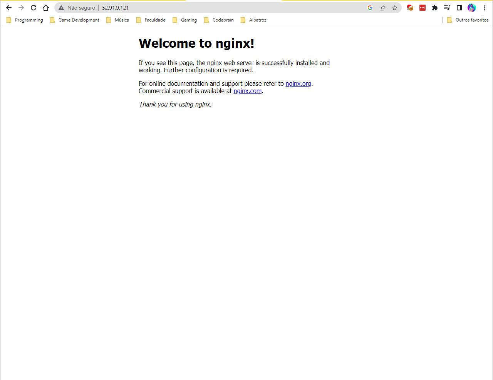
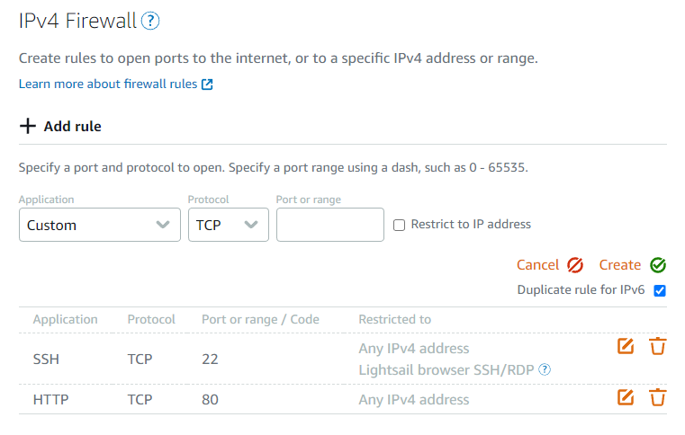

# Amazon Lightsail
Fast paced apps and sites with pre-configured cloud resources. Serves the main purpose of launching customized VMs.

Some available options are the platform and it's blueprint. As if it is an apps + os blueprint or just the os. This could come in handy if you for example just want to build a wordpress vm so you can get that blueprint directly.

//TODO: Add section on Additional Disks 

## Lightsail CLI
Without need to add specific configuration or keys, through Lightsail interface you can select the little cli icon set on the instance and this opens up a terminal window already connected to your instance in Lightsail. This is useful for getting wordpress credentials for example.

## Static IP and DNS for Lightsail Instance
Under instance breadcrumb configuration and in "manage" section you can select and configure IP's. *Static IP's that are connected to an instance are not charged. Static IP's that are not connected to an instance are charged.*

### NameCheap
It is useful to use a service such as NameCheap to generate cheap domain names that you can have in your account and link them to an static IP you've generated as mentioned above.

## Instance Creation
Everything is very straightforward through the UI, there's not much secret to it.
*If the instance is deleted, the Static IP is _NOT_ deleted, therefore you need to do it manually.*

## Availability Zones
They exist in order for you to have more availability in case one or more zones go out. You select a Region and inside each region you have a number of Availability Zones.

## Custom SSH Keys
When you create your instance in Lightsail you can select to use a custom SSH keypair. Keep in mind that *each keypair is related to one region*.

## Firewall Rules
After installing nginx on ubuntu instance provisioned through Lightsail it should be make it available through the IP of the instance.

At this point you do not have an specified port for access. Some ports are already set, and in order to change this feature, you'd need to go into the Networking tab again add or change rules. Note that you can create/set ports for IPv4 and (or) IPv6.

The default available ports through Firewall Rules are 22 and 80

## Creating Instances From Snapshots
This feature have some interesting uses, such as backup snapshots or even for having a quick way to build up from that expected point, pretty much making your instance become a possible template for another instances. Keep in mind that *when you need to take an snapshot from the instance, you should STOP the instance*, just so you don't loose any data that was being kept in memory or do not face corrupted data.

### Automatic Snapshots
This feature enables the setup of automatic snapshots that will run periodically, so you don't loose that much data from time to time in the case of an inconvenience.

## Load Balance
From a snapshot you'll be able to create another instance, that's what i did to be able to select some configurations in the Load Balance section. This can be eased if you create static IP's for each instance.

### Load Balancer Creation
Pretty easy, easy to find from the UI. It has a cost though, it does not come in the free tier.

## Alarms
Alarms can also be created on through the UI, and therefore you can setup email triggers for when you have less than x instances available for example.